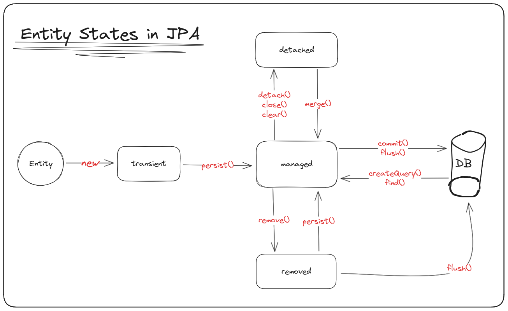

# Implementing JPA with Hibernate

As modern developers, we're able to benefit from the use of some amazing libraries and frameworks just like Spring, Spring Data JPA and Hibernate. These technologies save our time and free us from the burden of verbose and complex manual implementations.

Being aware and up-to-date with these tools is essential to anyone who values efficiency and performance, but sometimes we may feel a little bit lost on how to use them. No one can deny that those high-level APIs are incredibly handy during production time, but not having a clear comprehension on how they operate or not having at least a notion of how they work behind the scenes may result in serious problems.

That's why I found it interesting to take a look in JPA and see how some of its fundamental concepts operate while using Hibernate as ORM. Now, I feel more confident to take a step forward and learn more about Spring Data JPA, Hibernate or any other framework or ORM provided by Java and its amazing ecosystem.

 

# Drafts and Notes

## JPA & Persistence Context

Persistence providers like Hibernate make use of persistence context to manage the entity lifecycle in an application.

#

### Persistence Context Definition

An EntityManager instance is associated with a persistence context. A persistence context is a set of entity instances in which for any persistent entity identity there is a unique entity instance. Within the persistence context, the entity and their lifecycle are managed. The EntityManager API is used to create and remove persistent entity instances, to find entities by their primary key, and to query over entities.

#

**The persistence context is the first-level cache where all the entities are fetched from the database or saved to the database.** It sits between our application and persistent storage.

Persistence context keeps track of any changes made into a managed entity. If anything changes during a transaction, then the entity is marked as dirty. When the transaction completes, these changes are flushed into persistent storage.

The EntityManager provided by JPA is the interface that lets us interact with the persistence context. Whenever we use the EntityManager, we are actually interacting with the persistence context.

If every change made in the entity makes a call to persistent storage, we can imagine how many calls will be made. This will lead to a performance impact because persistent storage calls are expensive.

 

## Persistence Context as an Abstraction

When we refer to the persistence context as an abstraction, we’re talking about the concept of a context provided by JPA (Java Persistence API) made of persistent entities. In this sense, the persistence context is a conceptual idea which describes an environment where entities are managed during a transaction lifecycle. As an abstraction, the persistence context is not attached to any JPA specific implementation, and is described as a set of functions and behaviors that must be provided.

 

## Implementation of the Persistence Context

When we refer to the persistence context in terms of something concrete, we’re talking about the real implementation of this concept by a library or JPA framework, such as Hibernate and EclipseLink.

In this sense, the persistence context is a specific data structure allocated in memory during the lifecycle of a transaction and is responsible for tracking and managing the persistent entities. This concrete implementation of persistence context may vary according to the persistence provider.

 

## Persistence Context Definitions

### Persistence Context

Describes the relationship between all the entity instances in our program and their representations in the underlying database.

### Instance

A specific copy of an entity in program memory.

 

## Entity Manager

The EntityManager provided by JPA in an interface through which you’re able to interact with the persistence context. Meanwhile the persistence context is a subjacent data structure that manages persistent entities during a transaction, the EntityManager is an API which you use to access and manipulate the persistence context.

In practical terms, you create the EntityManager by using the EntityManagerFactory, which is responsible for creating EntityManager instances associated with a specific persistence context. Each EntityManager instance is linked with a single persistence context during this instance lifetime.

As mentioned, each EntityManager instance is associated with a specific persistence context, and each persistence context is created when an EntityManager is instantiated. Therefore, each single instance of an EntityManager will have its own persistence context.

Each persistence context can have different transactions in which queries and persistence operations will be performed.

 

## Hibernate & Persistence Context

Both the **org.hibernate.Session API** and **jakarta.persistence.EntityManager API** represent a context for dealing with persistent data. This concept is called a persistence context. Persistent data has a state in relation to both a persistence context and the underlying database.

### transient

The entity has just been instantiated and is not associated with a persistence context. It has no persistent representation in the database and typically no identifier value has been assigned (unless the assigned generator was used).

### managed or persistent

The entity has an associated identifier and is associated with a persistence context. It may or may not physically exist in the database yet.

### detached

The entity has an associated identifier but is no longer associated with a persistence context (usually because the persistence context was closed or the instance was evicted from the context).

### removed

The entity has an associated identifier and is associated with a persistence context, however it is scheduled for removal from the database.

Much of the **org.hibernate.Session** and **jakarta.persistence.EntityManager** methods deal with moving entities among these states.

 

 

# References 

* [Baeldung - JPA/Hibernate Persistence Context](https://www.baeldung.com/jpa-hibernate-persistence-context)

* [Medium @Sol - Java Persistence API(JPA)](https://medium.com/@nandaras0103/java-persistence-api-52c6731608dd)

* [Hibernate ORM User Guide](https://docs.jboss.org/hibernate/orm/6.4/userguide/html_single/Hibernate_User_Guide.html)

* [Entity Life cycle - JPA, Hibernate - Miss Xing](https://youtu.be/j6MHydQrXoE?si=pIB3KoJ_rm-yyWy5)

* [Persistence Context - Miss Xing](https://youtu.be/EkVsf46ze8o?si=53CEZ_QmK_aZVFbE)